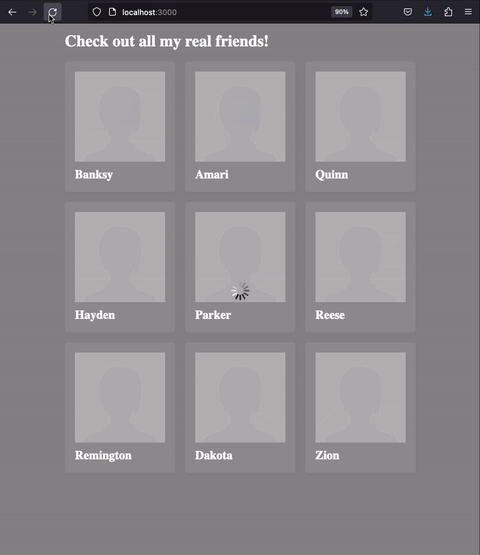

# 6 - Async

Dans ce labo, vous allez pouvoir vous exercer avec les Promises et la programmation asynchrone en JS.

Nous vous fournissons un backend express qui sert les requêtes `GET` sur les chemins suivants :
- `/people.json` répond avec un tableau de noms de personnes, au format JSON. Ce tableau peut être différent à chaque nouvelle requête.
- `/picture/<user>` répond avec la photo de profile au format JPG de la personne `<user>`. Notez que certaines personnes peuvent être listées dans `people.json` sans avoir de photo de profile, auquel cas une requête vers `/picture/<user>` échouera avec un code 404.

Le but de ce labo est d'implémenter la partie frontend utilisant cet API pour demander la liste des personnes à afficher donnée par `/people.json`, puis charger les photos de profile de chaque personne et les afficher sous la forme d'une grille de tuiles à 3 colonnes. Malheureusement, le serveur se trouve (prétendre) être lent à trouver ces photos, et il serait donc inefficace de les charger séquentiellement.

L'expérience utilisateur que nous voulons avoir est la suivante :
- Dès le chargement de la page, la liste des personnes est obtenue par le navigateur, et pour chaque personne dans cette liste, une tuile est créée et affichée, avec son nom. La photo de profile de chaque personne est demandée au serveur, et tant qu'elle n'est pas reçue, `placeholder_profile.jpg` est affiché. Pour l'affichage d'une tuile, nous vous fournissons un template dans `index.html` avec un id `#card-template`. Il n'est pas affiché par défaut, mais nous vous recommandons de le laisser et de le cloner à l'aide de JS à chaque fois que vous devez créer une nouvelle tuile.
- Un voile de chargement est immédiatement affiché par dessus l'intégralité de la page afin de clarifier que la page est encore en chargement. Similairement, ce voile est fourni dans `index.html` et invisibilisé avec la classe `.hidden`.
- Dès que le serveur trouve et renvoie une photo de profile, celle-ci est affichée et remplace l'image placeholder sur la tuile correspondante.
- Une fois que toutes les requêtes de photo de profile ont obtenu réponse (trouvée ou non), le voile de chargement peut être retiré, afin d'indiquer que la page a fini de charger.

Le rendu attendu est donc le suivant :

## Rendu

Tous vos changements sont à faire dans le fichier `public/script.js`. Nous vous demandons de ne pas toucher aux autres fichiers.

## Tests

Ce labo n'a pas de test automatisé. Nous évaluerons visuellement que votre rendu satisfait la donnée. Concrêtement, nous nous baserons principalement sur les éléments suivants :
- Le placeholder doit être affiché immédiatement sur chaque tuile, avec la classe `.loading` afin qu'il bénéficie de l'animation fournie dans `style.css`.
- Le placeholder doit rester affiché tout le long du chargement de l'image, puis remplacé par la nouvelle une fois celle-ci reçue, ou bien par un placeholder sans `.loading` si celle-ci n'a pas été trouvée par le serveur.
- Le chargement des images doit se faire de manière concurrente.
- Le voile de chargement doit s'afficher correctement et dès l'obtention des noms des personnes à afficher, puis disparaitre dès la réception de la dernière image.
- Les photos de profile doivent être affichées sur la tuile de la bonne personne.
- Votre code doit utiliser des Promises et des fonctions async/await pour réaliser tout ceci.

---

> *__Disclaimer__ : all profile pictures were obtained from [https://thispersondoesnotexist.com/](https://thispersondoesnotexist.com/).*